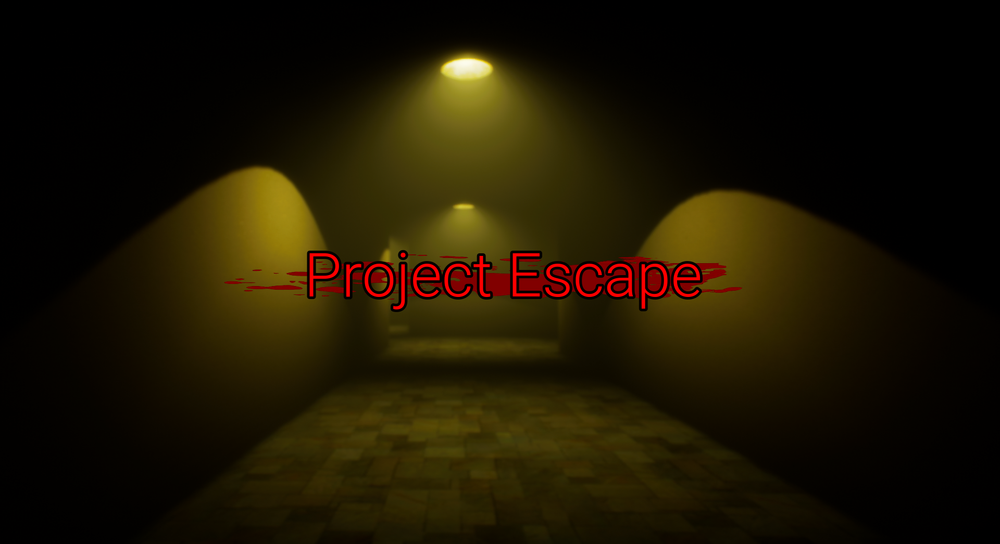
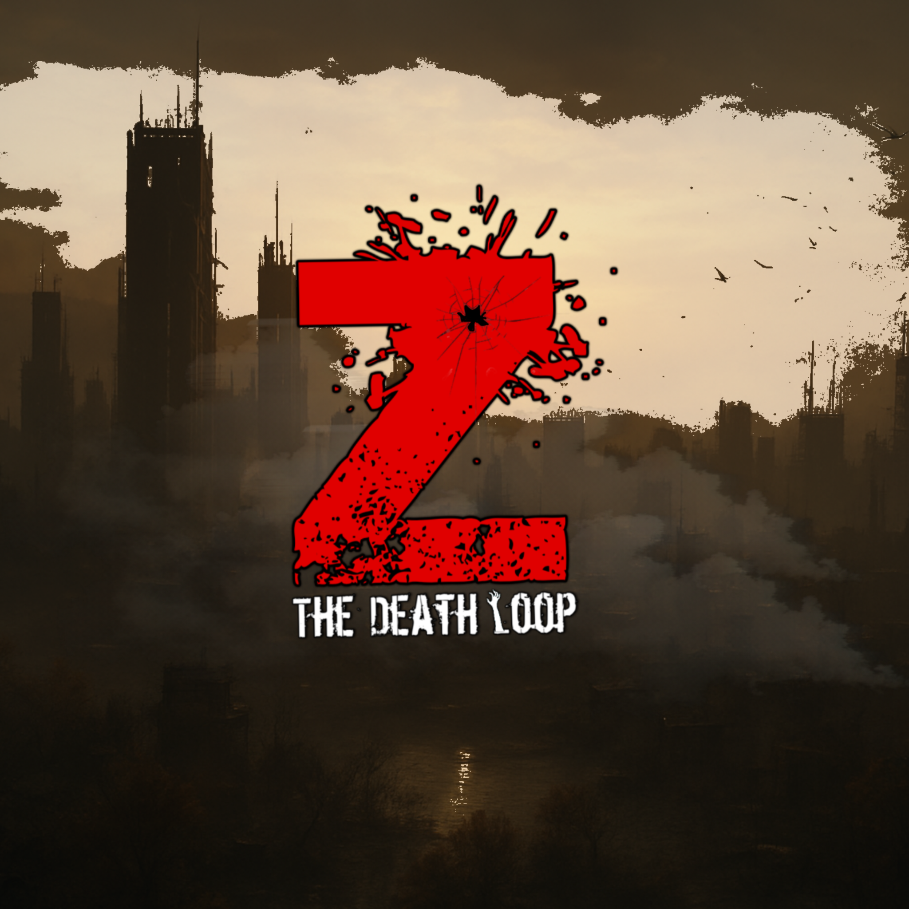
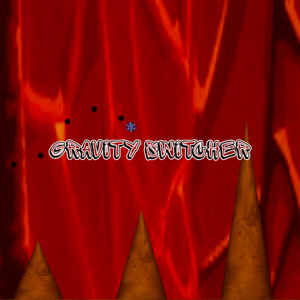
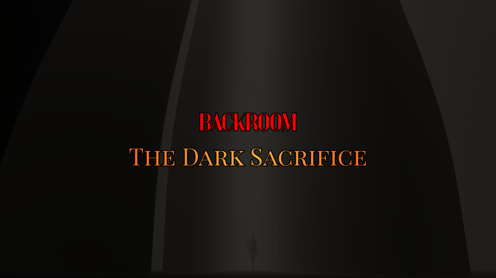

# 🎮 MD Hasibul Islam — Game Developer Portfolio

**Unreal Engine Game Developer | Level Designer | Gameplay Programmer**  
*Passionate about creating immersive survival horror, high-octane action arcade, and multiplayer co-op experiences.*

[🌐 Live Portfolio Website](#) • [🕹️ Itch.io Profile](https://game-dev-hasib.itch.io) • [📺 YouTube Trailers](https://www.youtube.com/watch?v=w2xAD6A0TTc) • [🐙 GitHub](https://github.com/GameDevHasib)

---

## 👨‍💻 About Me

> **MD Hasibul Islam**  
> *Unreal Engine Game Developer*

A passionate and dedicated game developer with experience in **Unreal Engine 4**, **Unreal Engine 5** and **level designing**, I excel at collaborating with diverse teams and adapting quickly to new challenges. Committed to continuous learning and self-improvement, I bring a strong work ethic and determination to succeed in the gaming industry. With a solid academic background in **Computer Science And Engineering**, I am eager to create engaging and immersive gaming experiences.

---

## 🚀 Featured Game Projects

### 01. Infernal Ritual

> **Genre:** Story-Driven Survival Horror  
> **Engine:** Unreal Engine 5  
> **Media:** [🎬 Infernal Ritual Trailer](https://www.youtube.com/watch?v=w2xAD6A0TTc) | [📦 Project Link (Google Drive)](https://drive.google.com/file/d/1qZ0F73PQyrIj315GghuGqvyNBZ1Jj22b/view?usp=sharing) | [🎮 Project Demo Link (Google Drive)](https://drive.google.com/file/d/1WABZbwlzfc6ZYYKhtv6pAfgu-g8zDM_j/view?usp=sharing)

"Infernal Ritual is a story-driven horror survival game where the player becomes trapped inside a relative’s house after uncovering traces of an ancient and forbidden immortal ritual. As the mystery unfolds, the player must survive escalating paranormal events while searching for a way to escape the cursed location. The narrative centers on disturbing family secrets, tragic past events, and the consequences of rituals that transcended death."

#### Gameplay Mechanics:
- 🗝️ Exploration-driven survival horror gameplay.
- 📜 Searching for keys, books, and ritual-related objects to progress.
- 🧩 Puzzle solving based on environmental clues, notes, and hidden messages.
- 🕯️ Dynamic paranormal events that increase tension and unpredictability.
- 👹 Demon encounters involving chase, stealth, and survival mechanics.
- 🚪 Hiding mechanics, including lockers and safe spots, to evade demonic entities.

---

### 02. Project Escape

> **Genre:** Fast-Paced Action Arcade  
> **Play Online:** [🕹️ Project Escape on Itch.io](https://game-dev-hasib.itch.io/project-escape)

Experience "[Project Escape](https://game-dev-hasib.itch.io/project-escape)" - A thrilling action-packed game where your reflexes and strategy are put to the ultimate test. In [Project Escape](https://game-dev-hasib.itch.io/project-escape), you’ll embark on a heart-pounding adventure as you run, collect coins, and outsmart a relentless ghost hot on your trail. Every move counts in this immersive experience where danger lurks around every corner. Can you outsmart the specter and emerge victorious?

#### Gameplay Mechanics:
- ⚡ **Speed Boosts:** Unleash bursts of speed to outrun the ghost and navigate the landscape faster than ever.
- 🧲 **Magnetic Coins:** Harness magnetic powers to attract nearby coins, making collection effortless and rewarding.
- 🛡️ **Angel Guardians:** Encounter angelic allies throughout your journey. Each angel you meet grants you the ability to temporarily banish the haunting entity, giving you a chance to escape and strategize.
- ❤️ **Extra Lives:** Discover extra lives hidden within the game world, allowing you to resurrect when faced with peril from the ghost.

---

### 03. Z The DeathLoop

> **Genre:** Stylized Survival, Base-Building & Action Shooter  
> **Links:** [🕹️ Z The DeathLoop on Itch.io](https://stroyed-studio.itch.io/z-the-death-loop) | [📦 Project Link (Google Drive)](https://drive.google.com/file/d/1hlJ5OH-RG5QunhEBjbq7GlkkKJHd9Hy3/view?usp=sharing)

"The world has fallen. You are one of the last survivors, and your only hope is the fortified base you’re building. Z The Death Loop is a dynamic, stylized Survival game that throws you into an endless cycle of Base-Building, Crafting, and intense Action. The horde never stops, and neither can you."

#### Gameplay Mechanics:
- 💥 **Endless Zombie Survival:** Face infinite, escalating waves in a high-replay survival experience.
- 🏗️ **Deep Base Building & Defense:** Design, build, and upgrade your fortified base to withstand smarter, stronger hordes.
- 🔫 **Action Shooter Combat:** Fast, responsive shooting combined with tactical defense and positioning.
- 🧰 **Crafting & Upgrades:** Craft weapons, traps, ammo, and structures using scavenged materials.
- 🗺️ **Scavenge the Wasteland:** Risk dangerous expeditions for rare resources—high risk, high reward.
- 🎯 **Strategic Resource Management:** Decide between reinforcing defenses or pushing deeper into deadly zones.
- 🎨 **Stylized Visuals:** Bold, clean art style for clear combat readability and a unique identity.
- 🔁 **Endless Replayability:** Every loop is different. Every run is a new challenge.

---

### 04. Gravity Switcher

> **Genre:** Precision Arcade & Physics  
> **Download:** [📦 Gravity Switcher (Google Drive)](https://drive.google.com/file/d/1LhIM0poviX4h6spXQ5aitXu57LYmQHZS/view?usp=sharing)

"Gravity Switcher is a challenging arcade game where the player controls a ball using simple click-based input. The core mechanic focuses on precise timing, gravity control, and player skill. The objective is to navigate through obstacles and difficult paths by mastering jump timing and air control."

#### Gameplay Mechanics:
- 🖱️ Single-click input to make the ball jump.
- 🕊️ Multiple clicks allow the ball to float temporarily in the air.
- 🎯 Precision-based obstacle navigation.
- ⚡ Hard paths that require careful control and quick decision-making.
- 📈 Increasing difficulty designed to test player reflexes and timing.

---

### 05. Backroom: The Dark Sacrifice

> **Genre:** Multiplayer Cooperative Horror  
> **Download:** [📦 Backroom: The Dark Sacrifice (Google Drive)](https://drive.google.com/file/d/1rHaoRHsLOgA7qM6JNdFfS1RFLwidN2HN/view?usp=sharing)

"Backroom: The Dark Sacrifice" is a multiplayer cooperative horror game where players must work together to escape the mysterious Backrooms. The environment is filled with puzzles, hostile entities, and constant tension. Players must explore, solve puzzles collaboratively, and survive while being hunted by ghosts that roam the maze-like corridors.

#### Gameplay Mechanics:
- 🌐 Multiplayer replication system to synchronize gameplay across connected players.
- 🖥️ Local server hosting system allowing players to create and join sessions.
- 🎲 Randomized puzzle generation to increase replayability in each session.
- 🧩 Puzzle-solving mechanics required to unlock paths and progress through the Backrooms.
- 👻 AI behavior system controlling ghost entities that chase and hunt players.
- ⚖️ Decision-making mechanics where player choices affect survival and rescue strategies.
- 🚪 Exploration-based gameplay within a maze-like Backrooms environment.

---

## 🛠️ Technical Competencies

| Domain | Tools & Technologies | Focus Areas |
| :--- | :--- | :--- |
| **Engines** | Unreal Engine 4, Unreal Engine 5 | Architecture, Gameplay Framework, Performance |
| **Programming** | C++, Blueprints Visual Scripting | Character Controllers, Game Systems, Mechanics |
| **Networking** | Unreal Netcode, Replication, RPCs | Client-Server Architecture, Local Hosting, State Sync |
| **AI Systems** | Behavior Trees, Blackboards, EQS | AI Perception, Hostile Entity Pathfinding, State Loops |
| **Level Design** | Unreal Editor, Lumen, Lighting, Post-FX | Environmental Storytelling, Atmosphere, Layout Pacing |
| **Academic** | Computer Science and Engineering (B.Sc.) | Algorithms, Data Structures, OOP, Software Engineering |

---

## 📬 Contact & Connect

- **GitHub:** [@GameDevHasib](https://github.com/GameDevHasib)
- **Itch.io:** [game-dev-hasib.itch.io](https://game-dev-hasib.itch.io)
- **Trailer Channel:** [YouTube Showcase](https://www.youtube.com/watch?v=w2xAD6A0TTc)

---

  Developed &amp; Designed with precision by <strong>MD Hasibul Islam</strong>

